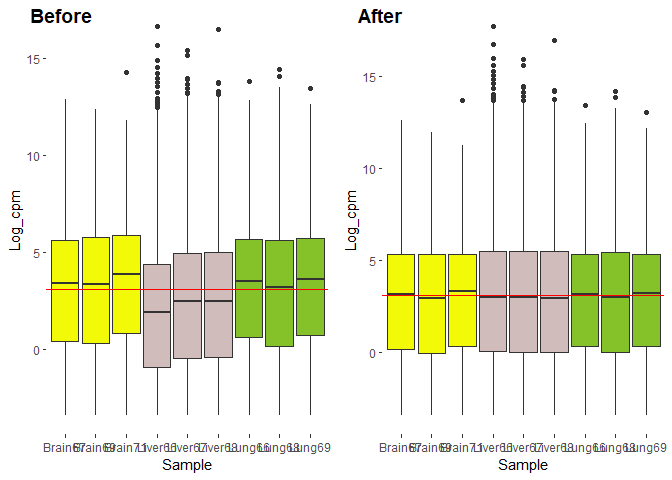

Bulk_analysis
================
Giulio Scarpa and Giovanni Martelletto
15/6/2022

``` r
knitr::opts_chunk$set(warning = FALSE, message = FALSE)
```

We start by cleaning the enviroment, setting up the working directory
and loading the packages

``` r
rm(list = ls())

library("recount3")
library("SummarizedExperiment")
library(ggplot2)
library(dplyr)
```

We load and inspect the previously downloaded rse (ranged summarized
experiment) containing the data we are interested in.

``` r
rse_brain <- readRDS("rse_brain.RDS")
rse_brain
```

    ## class: RangedSummarizedExperiment 
    ## dim: 54042 2931 
    ## metadata(8): time_created recount3_version ... annotation recount3_url
    ## assays(1): raw_counts
    ## rownames(54042): gene14440 gene14441 ... gene54248 gene54249
    ## rowData names(25): source type ... standard_name codons
    ## colnames(2931): GTEX-T6MN-0011-R1A-SM-32QOY.1 GTEX-WWYW-3126-SM-3NB39.1
    ##   ... GTEX-1O9I2-3026-SM-E76PX.1 GTEX-1OJC4-2826-SM-E6CQX.1
    ## colData names(198): rail_id external_id ... recount_seq_qc.errq
    ##   BigWigURL

The data is composed by 2931 samples and 54042 genes from brain samples
of healthy patients. Additional information can be accessed through the
metadata.

For our purposes we only need 3 samples of each tissue type so we will
need to do some selection. We start the selection by chosing the first 3
samples with column indexes following the last 2 digits of my
immatricolation number. The next step is to verify some quality
parameters to evaluate if the samples are eligible.

The first quality control is the RIN score (RNA Integrity Number) which
is a measure of the degradation of the RNA during the sample
preparation. The RIN score has to be higher than 6.0 to be acceptable.

``` r
colData(rse_brain)$gtex.smrin[67] # first column
```

    ## [1] 7.1

``` r
colData(rse_brain)$gtex.smrin[68] # no
```

    ## [1] 5.9

``` r
colData(rse_brain)$gtex.smrin[69] # second column
```

    ## [1] 7.5

``` r
colData(rse_brain)$gtex.smrin[70] # no
```

    ## [1] 5.9

``` r
colData(rse_brain)$gtex.smrin[71] # third column
```

    ## [1] 6.2

The next quality parameter is the presence of rRNA. If the rRNA
depletion procedures worked correclty we should have less than 0.1 of
rRNA in our samples.

``` r
#rrna %
colData(rse_brain)$gtex.smrrnart[67] 
```

    ## [1] 0.0451209

``` r
colData(rse_brain)$gtex.smrrnart[69]
```

    ## [1] 0.0149719

``` r
colData(rse_brain)$gtex.smrrnart[71]
```

    ## [1] 0.0789582

``` r
# fraction of rRNA < 0.1 in all columns
```

Finally, we subset the original file with just the samples we need and
inspect the object.

``` r
rse_brain_samples <- rse_brain[,c(67,69,71)] #getting the samples
rse_brain_samples
```

    ## class: RangedSummarizedExperiment 
    ## dim: 54042 3 
    ## metadata(8): time_created recount3_version ... annotation recount3_url
    ## assays(1): raw_counts
    ## rownames(54042): gene14440 gene14441 ... gene54248 gene54249
    ## rowData names(25): source type ... standard_name codons
    ## colnames(3): GTEX-1I1CD-0011-R6b-SM-CJI3Y.1 GTEX-1I1GV-3026-SM-CNNR9.1
    ##   GTEX-1I1HK-0011-R8b-SM-E8VN9.1
    ## colData names(198): rail_id external_id ... recount_seq_qc.errq
    ##   BigWigURL

We follow the same procedure for the liver and lung samples.

``` r
rse_liver <- readRDS("rse_liver.RDS")

colData(rse_liver)$gtex.smrin[66] #OK
```

    ## [1] 8.6

``` r
colData(rse_liver)$gtex.smrin[67] #OK
```

    ## [1] 6.2

``` r
colData(rse_liver)$gtex.smrin[68] #OK
```

    ## [1] 6.1

``` r
colData(rse_liver)$gtex.smrrnart[66] #OK
```

    ## [1] 0.00861347

``` r
colData(rse_liver)$gtex.smrrnart[67] #OK
```

    ## [1] 0.02097

``` r
colData(rse_liver)$gtex.smrrnart[68] #OK
```

    ## [1] 0.0262482

``` r
rse_liver_samples <- rse_liver[,c(66,67,68)] #getting the samples

rse_lung <- readRDS("rse_lung.RDS")

colData(rse_lung)$gtex.smrin[66] #OK
```

    ## [1] 6.6

``` r
colData(rse_lung)$gtex.smrin[67] #NO
```

    ## [1] 5.8

``` r
colData(rse_lung)$gtex.smrin[68] #OK
```

    ## [1] 8.1

``` r
colData(rse_lung)$gtex.smrin[69] #OK
```

    ## [1] 7.6

``` r
colData(rse_lung)$gtex.smrrnart[66] #OK
```

    ## [1] 0.00366338

``` r
colData(rse_lung)$gtex.smrrnart[68] #OK
```

    ## [1] 0.00378793

``` r
colData(rse_lung)$gtex.smrrnart[69] #OK
```

    ## [1] 0.00272615

``` r
rse_lung_samples <- rse_lung[,c(66,68,69)] #getting the samples
```

Once we have our samples we can start exploring our metadata. We can
check for example as an extra quality control procedure the % of mapped
pair-end reads in each sample. These are the ones used for the counts.

``` r
colData(rse_brain_samples)$"recount_qc.star.%_mapped_reads_both"
```

    ## [1] 96.9 95.7 96.9

``` r
colData(rse_liver_samples)$"recount_qc.star.%_mapped_reads_both"
```

    ## [1] 97.4 95.0 94.0

``` r
colData(rse_lung_samples)$"recount_qc.star.%_mapped_reads_both"
```

    ## [1] 95.9 94.1 92.8

We can check the specific subtypes of tissues that were used in our
samples

``` r
table(colData(rse_brain_samples)$gtex.smtsd)
```

    ## 
    ##                        Brain - Cerebellum 
    ##                                         1 
    ##                      Brain - Hypothalamus 
    ##                                         1 
    ## Brain - Nucleus accumbens (basal ganglia) 
    ##                                         1

While Liver and Lung presents the same type of tissue, Brain samples are
from 3 different areas of the organ. This is expected to be the cause of
some variability between samples.

We can also check age and sex of the donors. These are also major causes
of variability.

``` r
table(colData(rse_brain_samples)$gtex.sex)
```

    ## 
    ## 1 2 
    ## 2 1

``` r
table(colData(rse_liver_samples)$gtex.sex)
```

    ## 
    ## 1 
    ## 3

``` r
table(colData(rse_lung_samples)$gtex.sex)
```

    ## 
    ## 1 
    ## 3

``` r
#Since we only have 1 different sex we can check if it explains variability

table(colData(rse_brain_samples)$gtex.age)
```

    ## 
    ## 60-69 
    ##     3

``` r
table(colData(rse_liver_samples)$gtex.age)
```

    ## 
    ## 30-39 50-59 60-69 
    ##     1     1     1

``` r
table(colData(rse_lung_samples)$gtex.age)
```

    ## 
    ## 50-59 60-69 
    ##     1     2

Most fo our donors have sex 1 with only one donor being different. Our
most present age range is 60-69.

Other useful information about our data is the number of reads and the %
of uniquely mapped reads of each sample.

``` r
colData(rse_brain_samples)$"recount_qc.star.number_of_input_reads_both"
```

    ## [1] 67375955 78251851 51722488

``` r
colData(rse_liver_samples)$"recount_qc.star.number_of_input_reads_both"
```

    ## [1] 72469303 42452149 34318700

``` r
colData(rse_lung_samples)$"recount_qc.star.number_of_input_reads_both"
```

    ## [1] 34869795 44725166 41234983

``` r
colData(rse_brain_samples)$"recount_qc.star.uniquely_mapped_reads_%_both"
```

    ## [1] 91.7 89.9 91.0

``` r
colData(rse_liver_samples)$"recount_qc.star.uniquely_mapped_reads_%_both"
```

    ## [1] 91.8 89.6 89.1

``` r
colData(rse_lung_samples)$"recount_qc.star.uniquely_mapped_reads_%_both"
```

    ## [1] 91.3 90.9 88.8

These preliminary inspections are useful for detecting low quality data
and predicting possible sources of variability and error during the
analysis step.

Now we can start exploring our genes. Since the genes are annotated in
the same way for all samples we can check only one of them. But first,
we need to transform the counts from genome ranges to counts.

``` r
assays(rse_brain_samples)$counts <- transform_counts(rse_brain_samples)
rse_brain_samples #2 assays now
```

    ## class: RangedSummarizedExperiment 
    ## dim: 54042 3 
    ## metadata(8): time_created recount3_version ... annotation recount3_url
    ## assays(2): raw_counts counts
    ## rownames(54042): gene14440 gene14441 ... gene54248 gene54249
    ## rowData names(25): source type ... standard_name codons
    ## colnames(3): GTEX-1I1CD-0011-R6b-SM-CJI3Y.1 GTEX-1I1GV-3026-SM-CNNR9.1
    ##   GTEX-1I1HK-0011-R8b-SM-E8VN9.1
    ## colData names(198): rail_id external_id ... recount_seq_qc.errq
    ##   BigWigURL

``` r
assays(rse_liver_samples)$counts <- transform_counts(rse_liver_samples)
rse_liver_samples
```

    ## class: RangedSummarizedExperiment 
    ## dim: 54042 3 
    ## metadata(8): time_created recount3_version ... annotation recount3_url
    ## assays(2): raw_counts counts
    ## rownames(54042): gene14440 gene14441 ... gene54248 gene54249
    ## rowData names(25): source type ... standard_name codons
    ## colnames(3): GTEX-1399R-1226-SM-5P9GF.1 GTEX-139TU-0826-SM-5IJFG.1
    ##   GTEX-13VXU-0926-SM-5IFFH.1
    ## colData names(198): rail_id external_id ... recount_seq_qc.errq
    ##   BigWigURL

``` r
assays(rse_lung_samples)$counts <- transform_counts(rse_lung_samples)
rse_lung_samples
```

    ## class: RangedSummarizedExperiment 
    ## dim: 54042 3 
    ## metadata(8): time_created recount3_version ... annotation recount3_url
    ## assays(2): raw_counts counts
    ## rownames(54042): gene14440 gene14441 ... gene54248 gene54249
    ## rowData names(25): source type ... standard_name codons
    ## colnames(3): GTEX-13QJ3-1026-SM-5QGQU.1 GTEX-111YS-0626-SM-5GZXV.1
    ##   GTEX-12696-1026-SM-5FQUV.1
    ## colData names(198): rail_id external_id ... recount_seq_qc.errq
    ##   BigWigURL

We can notice that after transformation we have 2 assays in our rse
object.

Genes can be classified in different ways. We can check some of the
labels and the number of genes from each label in our samples

``` r
table(rowData(rse_brain_samples)$gbkey)
```

    ## 
    ##      C_region     D_segment          Gene     J_segment      misc_RNA 
    ##            39            61          7415           128          1369 
    ##          mRNA         ncRNA precursor_RNA          rRNA          tRNA 
    ##         17169         18734          2051            56           597 
    ##     V_segment 
    ##           659

We are not interested in a lot of the genes present in our annotations.
So we need to filter them. In particular we need to filter mRNA, rRNA
and pseudogenes (because they are not reliable). We can also see that
there are some genes annotated on non-canonical chromosomes, they need
to be removed as well.

We procede with the filters

``` r
canonical <- paste("chr", seq(1,22), sep="")
canonical <- c(canonical, "chrX", "chrY")

# Filter brain
rse_brain_canonical <- rse_brain_samples[rowData(rse_brain_samples)$gbkey !=                         'rRNA' & rowData(rse_brain_samples)$gbkey != 'Gene' &                         rowRanges(rse_brain_samples)@seqnames %in% canonical &                        !is.na(rowData(rse_brain_samples)$gbkey),]

# Filter Liver
rse_liver_canonical <- rse_liver_samples[rowData(rse_liver_samples)$gbkey !=                         'rRNA' & rowData(rse_liver_samples)$gbkey != 'Gene' &                         rowRanges(rse_liver_samples)@seqnames %in% canonical &                        !is.na(rowData(rse_liver_samples)$gbkey),]

# Filter Lung
rse_lung_canonical <- rse_lung_samples[rowData(rse_lung_samples)$gbkey !=                           'rRNA' & rowData(rse_lung_samples)$gbkey != 'Gene' & 
                      rowRanges(rse_lung_samples)@seqnames %in% canonical &                         !is.na(rowData(rse_lung_samples)$gbkey),]
```

Now let’s get the counts to build the count matrices.

``` r
counts_brain_canonical <- assays(rse_brain_canonical)$counts

counts_liver_canonical <- assays(rse_liver_canonical)$counts

counts_lung_canonical <- assays(rse_lung_canonical)$counts
```

We change the genes identifications from an internal one to an universal
one, gene symbols. Then we build the whole matrix with all the samples.

``` r
rownames(counts_brain_canonical) <- rowData(rse_brain_canonical)$gene_name
rownames(counts_liver_canonical) <- rowData(rse_liver_canonical)$gene_name
rownames(counts_lung_canonical) <- rowData(rse_lung_canonical)$gene_name

#create the whole matrix count
data <- cbind(counts_brain_canonical, counts_liver_canonical, counts_lung_canonical)
#Rename the columns
colnames(data) <- c( "Brain67", "Brain69",  "Brain71",  "Liver66", "Liver67"
                     ,"Liver68", "Lung66", "Lung68",  "Lung69")
```

We can finally look at the count matrix of all samples

``` r
head(data)
```

    ##           Brain67 Brain69 Brain71 Liver66 Liver67 Liver68 Lung66 Lung68 Lung69
    ## DDX11L1        68      24       6       2       4       9      7     12      9
    ## MIR6859-1       6      11       7       3       5       2     11      4     12
    ## MIR6859-1      11      21      14       6      11       4     25      8     21
    ## WASH7P        888    1619    1045     361     620     471   1572    778   1366
    ## MIR1302-2       0       0       0       0       0       0      0      0      0
    ## MIR1302-2       0       0       0       0       0       0      0      0      0

We can check the library sizes, the sum of counts in each sample

``` r
library_sizes <- colSums(data)
library_sizes
```

    ##  Brain67  Brain69  Brain71  Liver66  Liver67  Liver68   Lung66   Lung68 
    ## 17823272 18480494 13824041 27894688 20582202 18417212 24010024 24302799 
    ##   Lung69 
    ## 22909413

Before we start analysing our data, we need to create a DGEList object
(Differential Gene Expression), for that purpose we use the library
EdgeR. We can start adding new fields to the object with the metadata
from the rse

``` r
library(edgeR)
y <- DGEList(counts=data)

#We can add new fields to the object
group <- as.factor(c(rep('Brain',3), rep('Liver',3), rep('Lung',3)))

y$samples$group <- group
y$samples$rin <- as.factor(c(colData(rse_brain_canonical)$gtex.smrin,colData(rse_liver_canonical)$gtex.smrin,colData(rse_lung_canonical)$gtex.smrin))
y$samples$slice <- as.factor(c(colData(rse_brain_canonical)$gtex.smtsd,colData(rse_liver_canonical)$gtex.smtsd,colData(rse_lung_canonical)$gtex.smtsd))
y$samples$sex <- as.factor(c(colData(rse_brain_canonical)$gtex.sex,colData(rse_liver_canonical)$gtex.sex,colData(rse_lung_canonical)$gtex.sex))
y$samples$age <- as.factor(c(colData(rse_brain_canonical)$gtex.age,colData(rse_liver_canonical)$gtex.age,colData(rse_lung_canonical)$gtex.age))
y$samples$rRNA <- as.factor(c(colData(rse_brain_canonical)$gtex.smrrnart,colData(rse_liver_canonical)$gtex.smrrnart,colData(rse_lung_canonical)$gtex.smrrnart))
y$samples$mapped <- as.factor(c(colData(rse_brain_canonical)$"recount_qc.star.uniquely_mapped_reads_%_both", colData(rse_liver_canonical)$"recount_qc.star.uniquely_mapped_reads_%_both",colData(rse_lung_canonical)$"recount_qc.star.uniquely_mapped_reads_%_both"))
y$samples$chrm <- as.factor(c(colData(rse_brain_canonical)$"recount_qc.aligned_reads%.chrm", colData(rse_liver_canonical)$"recount_qc.aligned_reads%.chrm",colData(rse_lung_canonical)$"recount_qc.aligned_reads%.chrm"))
head(y)
```

    ## An object of class "DGEList"
    ## $counts
    ##           Brain67 Brain69 Brain71 Liver66 Liver67 Liver68 Lung66 Lung68 Lung69
    ## DDX11L1        68      24       6       2       4       9      7     12      9
    ## MIR6859-1       6      11       7       3       5       2     11      4     12
    ## MIR6859-1      11      21      14       6      11       4     25      8     21
    ## WASH7P        888    1619    1045     361     620     471   1572    778   1366
    ## MIR1302-2       0       0       0       0       0       0      0      0      0
    ## MIR1302-2       0       0       0       0       0       0      0      0      0
    ## 
    ## $samples
    ##         group lib.size norm.factors rin
    ## Brain67 Brain 17823272            1 7.1
    ## Brain69 Brain 18480494            1 7.5
    ## Brain71 Brain 13824041            1 6.2
    ## Liver66 Liver 27894688            1 8.6
    ## Liver67 Liver 20582202            1 6.2
    ## Liver68 Liver 18417212            1 6.1
    ## Lung66   Lung 24010024            1 6.6
    ## Lung68   Lung 24302799            1 8.1
    ## Lung69   Lung 22909413            1 7.6
    ##                                             slice sex   age       rRNA mapped
    ## Brain67 Brain - Nucleus accumbens (basal ganglia)   2 60-69  0.0451209   91.7
    ## Brain69                        Brain - Cerebellum   1 60-69  0.0149719   89.9
    ## Brain71                      Brain - Hypothalamus   1 60-69  0.0789582     91
    ## Liver66                                     Liver   1 30-39 0.00861347   91.8
    ## Liver67                                     Liver   1 60-69    0.02097   89.6
    ## Liver68                                     Liver   1 50-59  0.0262482   89.1
    ## Lung66                                       Lung   1 50-59 0.00366338   91.3
    ## Lung68                                       Lung   1 60-69 0.00378793   90.9
    ## Lung69                                       Lung   1 60-69 0.00272615   88.8
    ##          chrm
    ## Brain67 26.43
    ## Brain69  9.38
    ## Brain71 36.88
    ## Liver66 10.49
    ## Liver67 21.28
    ## Liver68 28.75
    ## Lung66   2.11
    ## Lung68   5.74
    ## Lung69   6.63

Now we need to filter all the genes that show no expression across all
the samples.

``` r
table(rowSums(y$counts==0)==9) #we check how many of them there are
```

    ## 
    ## FALSE  TRUE 
    ## 29220  6529

``` r
dim(y)
```

    ## [1] 35749     9

``` r
#filterByExpr is a function that filters the genes with 0 or close to 0 expression accross all samples
keep.exprs <- filterByExpr(y)
y <- y[keep.exprs,, keep.lib.sizes=FALSE] #genes that remain
dim(y)
```

    ## [1] 17066     9

Now we transform the counts in CPM (counts per million) and perform TMM
(Trimmed Mean of Ms) normalization on them. We can verify how the logcpm
values change from before the normalization to after it.

``` r
#transforms the counts in CPM with logaritmization
logcpm_before <- cpm(y, log=TRUE)

#Normalization with TMM method
y <- calcNormFactors(y, method = "TMM")
logcpm <- cpm(y, log=TRUE)
y$logcpm <- logcpm

#Plotting with a nice ggplot
logcpm_before <- as.data.frame(logcpm_before)
logcpm_before.m <- reshape2::melt(logcpm_before, id.vars = NULL)
colnames(logcpm_before.m) <- c('Sample', 'Log_cpm')
logcpm_before.m$Tissue <- NA
logcpm_before.m$Tissue[grepl('^B', logcpm_before.m$Sample)] <- 'Brain'
logcpm_before.m$Tissue[grepl('^Li', logcpm_before.m$Sample)] <- 'Liver'
logcpm_before.m$Tissue[grepl('^Lu', logcpm_before.m$Sample)] <- 'Lung'

logcpm <- as.data.frame(logcpm)
logcpm.m <- reshape2::melt(logcpm, id.vars = NULL)
colnames(logcpm.m) <- c('Sample', 'Log_cpm')
logcpm.m$Tissue <- NA
logcpm.m$Tissue[grepl('^B', logcpm.m$Sample)] <- 'Brain'
logcpm.m$Tissue[grepl('^Li', logcpm.m$Sample)] <- 'Liver'
logcpm.m$Tissue[grepl('^Lu', logcpm.m$Sample)] <- 'Lung'
table_norm_fact <- DataFrame(sample_Id = rownames(y$samples), 
                             Norm_Factors=y$samples$norm.factors)

p1 <- ggplot(logcpm_before.m, aes(x=Sample, y=Log_cpm, fill=Tissue)) + 
      geom_boxplot(width=0.9) + 
      geom_hline(yintercept = median(logcpm_before.m$Log_cpm), color='red') +
      scale_fill_manual(values=c("#f2fa07", "#d1bcbc", "#85c229")) + 
      theme(legend.position="none", panel.background = element_rect(fill = "white"))

p2 <- ggplot(logcpm.m, aes(x=Sample, y=Log_cpm, fill=Tissue)) +
      geom_boxplot(width=0.9) + 
      geom_hline(yintercept = median(logcpm.m$Log_cpm), color='red') +
      scale_fill_manual(values=c("#f2fa07", "#d1bcbc", "#85c229")) +
      theme(legend.position="none", panel.background = element_rect(fill = "white"))
```

``` r
library(cowplot)
plot_grid(p1, p2, labels = c('Before', 'After'))
```

<!-- -->
We can see that after normalization the values are much more centered
around the median values allowing comparison of the expression of genes
between different samples.

The next step is to verify how the samples are clustered. For this
purpose we use Multidimentional Scaling to plot in 2d the difference
between the samples.

``` r
plotMDS(logcpm, labels=group, main='Sample Clusters')
```

<!-- -->

``` r
plotMDS(logcpm, labels=y$samples$rin, main='RIN Clusters')
```

<!-- -->

``` r
plotMDS(logcpm, labels=y$samples$age ,main='Age Clusters')
```

<!-- -->

``` r
#2 female, 1 male
plotMDS(logcpm, labels=y$samples$sex, pch=19 ,main='Sex Clusters')
```

<!-- -->
As shown above, the main variable affecting the clustering is the tissue
type.

Now we need to build a design matrix which will be used to build the
linear model that estimates the difference in expression between the
different groups of conditions. We opted to use a model without
intercept since none of the conditions we are dealing with (in this
specific case, tissues) are ‘developments’ of a basal condition, they
are independent.

``` r
design <- model.matrix(~0+group, data=y$samples)
colnames(design) <- levels(y$samples$group)
design
```

    ##         Brain Liver Lung
    ## Brain67     1     0    0
    ## Brain69     1     0    0
    ## Brain71     1     0    0
    ## Liver66     0     1    0
    ## Liver67     0     1    0
    ## Liver68     0     1    0
    ## Lung66      0     0    1
    ## Lung68      0     0    1
    ## Lung69      0     0    1
    ## attr(,"assign")
    ## [1] 1 1 1
    ## attr(,"contrasts")
    ## attr(,"contrasts")$group
    ## [1] "contr.treatment"

Using the design matrix as a guide, it is possible to model the
expression of each gene as following a negative binomial distribution
that uses the dispersion as a measure of biological variation between
samples.

``` r
y <- estimateDisp(y, design)
plotBCV(y, main='Negative Bin & Dispersion Across Samples')
```

<!-- -->
As we can see, the dispersion is high among samples.

``` r
y$common.dispersion
```

    ## [1] 0.2883188

``` r
y$dispersion <- DataFrame(row.names = rownames(y$counts), gene_dispersion = y$tagwise.dispersion)

#Checking the gene with highest and lowest dispersion
rownames(y$dispersion)[which(y$dispersion$gene_dispersion==max(y$dispersion$gene_dispersion))]
```

    ## [1] "GH1"

``` r
rownames(y$dispersion)[which(y$dispersion$gene_dispersion==min(y$dispersion$gene_dispersion))]
```

    ## [1] "CDK4"

``` r
y$counts[which(y$dispersion$gene_dispersion==max(y$dispersion$gene_dispersion)),]
```

    ## Brain67 Brain69 Brain71 Liver66 Liver67 Liver68  Lung66  Lung68  Lung69 
    ##       0    1655       0       8     128     265       6       0     222

``` r
y$counts[which(y$dispersion$gene_dispersion==min(y$dispersion$gene_dispersion)),]
```

    ## Brain67 Brain69 Brain71 Liver66 Liver67 Liver68  Lung66  Lung68  Lung69 
    ##    1052    1147    1033    1081    1152     984    2295    2160    2545

Interestingly the gene presenting highest dispersion across tissues is
the Growth Hormone 1 which should in theory be expressed almost
exclusively at the Pituitary gland but in our samples shows a wide range
of expression.

Easier to explain is the consistent expression of CDK4. This is a
Cycline Dependent Kinase that plays an important role on cell cycle thus
having a tightly controlled expression across all proliferating cells.

Now we fit the model and obtain the results of the top DE genes sorted
by the adjusted p-value which takes into account the false discovery
rate. The difference in expression is is shown by the Log Fold Change
metric. Genes with negative LogFC are downregulated, genes with positive
LogFC are upregulated.

``` r
fit <- glmQLFit(y, design)

#liver (top) vs brain (bottom)
qlf_Li_B <- glmQLFTest(fit, contrast=c(-1,1,0))

#lung (top) vs brain (bottom)
qlf_Lu_B <- glmQLFTest(fit, contrast=c(-1,0,1))

#lung (top) vs liver (bottom)
qlf_Lu_Li <- glmQLFTest(fit, contrast=c(0,-1,1))

resultsLi_B <- topTags(qlf_Li_B, n= 25000, adjust.method = "BH", sort.by ="PValue")
resultsLu_B <- topTags(qlf_Lu_B, n= 25000, adjust.method = "BH", sort.by ="PValue")
resultsLu_Li <- topTags(qlf_Lu_Li, n= 25000, adjust.method = "BH", sort.by ="PValue")
```

Now we perform some filtering in the results by selecting genes that
has: \* at least 1 unit of Log2FC (negative or positive) \* adjusted
p-velue lower than 0.01 \* LogCPM higher than 0 \* Unnanotated genes
(important for the enrichment analysis step)

``` r
resultsLi_B <- as.data.frame(resultsLi_B)
dim(resultsLi_B)
```

    ## [1] 17066     5

``` r
resultsLi_B <- resultsLi_B[which((resultsLi_B$logFC > 1 | resultsLi_B$logFC < -1) & resultsLi_B$FDR < 0.01), ]                    
#Filter by logCPM < 0 for false positives
resultsLi_B <- resultsLi_B[which(resultsLi_B$logCPM > 0),]
#Filtering LOC, RIN etc genes
resultsLi_B <- resultsLi_B[!(grepl('^LOC', rownames(resultsLi_B)) |
                             grepl('^LINC', rownames(resultsLi_B)) |
                             grepl('^MIR', rownames(resultsLi_B)) |
                             grepl('^SNORD', rownames(resultsLi_B)) |
                             grepl('^RPL', rownames(resultsLi_B))),]
dim(resultsLi_B)
```

    ## [1] 4375    5

``` r
resultsLu_B <- as.data.frame(resultsLu_B)
dim(resultsLu_B)
```

    ## [1] 17066     5

``` r
resultsLu_B <- resultsLu_B[which((resultsLu_B$logFC > 1 | resultsLu_B$logFC < -1) & resultsLu_B$FDR < 0.01), ]      
resultsLu_B <- resultsLu_B[which(resultsLu_B$logCPM > 0),]
resultsLu_B <- resultsLu_B[!(grepl('^LOC', rownames(resultsLu_B)) |
                                 grepl('^LINC', rownames(resultsLu_B)) |
                                 grepl('^MIR', rownames(resultsLu_B)) |
                                 grepl('^SNORD', rownames(resultsLu_B)) |
                                 grepl('^RPL', rownames(resultsLu_B))),]
dim(resultsLu_B)
```

    ## [1] 3223    5

``` r
resultsLu_Li <- as.data.frame(resultsLu_Li)
dim(resultsLu_Li)
```

    ## [1] 17066     5

``` r
resultsLu_Li <- resultsLu_Li[which((resultsLu_Li$logFC > 1 | resultsLu_Li$logFC < -1) & resultsLu_Li$FDR < 0.01), ]      
resultsLu_Li <- resultsLu_Li[which(resultsLu_Li$logCPM > 0),]
resultsLu_Li <- resultsLu_Li[!(grepl('^LOC', rownames(resultsLu_Li)) |
                               grepl('^LINC', rownames(resultsLu_Li)) |
                               grepl('^MIR', rownames(resultsLu_Li)) |
                               grepl('^SNORD', rownames(resultsLu_Li)) |
                               grepl('^RPL', rownames(resultsLu_Li))),]
dim(resultsLu_Li)
```

    ## [1] 2784    5

We rearrange the results table in a more informative way

``` r
#Li_B
resultsLi_B <- resultsLi_B %>%
  mutate(Brain = case_when(
    resultsLi_B$logFC < 0 ~ row.names(resultsLi_B),
    resultsLi_B$logFC > 0 ~ ''))

resultsLi_B <- resultsLi_B %>%
  mutate(Liver = case_when(
    resultsLi_B$logFC > 0 ~ row.names(resultsLi_B),
    resultsLi_B$logFC < 0 ~ ''))

#Lu_B
resultsLu_B <- resultsLu_B %>%
  mutate(Brain = case_when(
    resultsLu_B$logFC < 0 ~ row.names(resultsLu_B),
    resultsLu_B$logFC > 0 ~ ''))

resultsLu_B <- resultsLu_B %>%
  mutate(Lung = case_when(
    resultsLu_B$logFC > 0 ~ row.names(resultsLu_B),
    resultsLu_B$logFC < 0 ~ ''))

#Lu_Li
resultsLu_Li <- resultsLu_Li %>%
  mutate(Liver = case_when(
    resultsLu_Li$logFC < 0 ~ row.names(resultsLu_Li),
    resultsLu_Li$logFC > 0 ~ ''))

resultsLu_Li <- resultsLu_Li %>%
  mutate(Lung = case_when(
    resultsLu_Li$logFC > 0 ~ row.names(resultsLu_Li),
    resultsLu_Li$logFC < 0 ~ ''))

head(resultsLi_B)
head(resultsLu_B)
head(resultsLu_Li)
```

Now we produce a dataframe containing the genes that are presente in
both comparisons between samples and thus are specific genes for that
tissue.

``` r
Both_Brain <- data.frame(Brain_Liver = resultsLi_B$Brain[which(resultsLi_B$Brain != '')], 
                         Brain_Lung = rep('', length(resultsLi_B$Brain[which(resultsLi_B$Brain != '')])), 
                         Brain_Both = rep('', length(resultsLi_B$Brain[which(resultsLi_B$Brain != '')])))
for (i in resultsLi_B$Brain[which(resultsLi_B$Brain != '')]) 
{
  if (i %in% resultsLu_B$Brain[which(resultsLu_B$Brain != '')])
  {
    Both_Brain$Brain_Both[which(Both_Brain$Brain_Liver == i)] <- i
    Both_Brain$Brain_Lung[which(Both_Brain$Brain_Liver == i)] <- i
  }
}

Both_Liver <- data.frame(Liver_Brain = resultsLi_B$Liver[which(resultsLi_B$Liver != '')], 
                         Liver_Lung = rep('', length(resultsLi_B$Liver[which(resultsLi_B$Liver != '')])),
                         Liver_Both = rep('', length(resultsLi_B$Liver[which(resultsLi_B$Liver != '')])))
for (i in resultsLi_B$Liver[which(resultsLi_B$Liver != '')]) 
{
  if (i %in% resultsLu_Li$Liver[which(resultsLu_Li$Liver != '')])
  {
    Both_Liver$Liver_Both[which(Both_Liver$Liver_Brain == i)] <- i
    Both_Liver$Liver_Lung[which(Both_Liver$Liver_Brain == i)] <- i
  }
}

Both_Lung <- data.frame(Lung_Brain = resultsLu_B$Lung[which(resultsLu_B$Lung != '')],
                        Lung_Liver = rep('', length(resultsLu_B$Lung[which(resultsLu_B$Lung != '')])),
                        Lung_Both = rep('', length(resultsLu_B$Lung[which(resultsLu_B$Lung != '')])))
for (i in resultsLu_B$Lung[which(resultsLu_B$Lung != '')]) 
{
  if (i %in% resultsLu_Li$Lung[which(resultsLu_Li$Lung != '')])
  {
    Both_Lung$Lung_Both[which(Both_Lung$Lung_Brain == i)] <- i
    Both_Lung$Lung_Liver[which(Both_Lung$Lung_Brain == i)] <- i
  }
}
```

We save the results

``` r
write.table(resultsLi_B, "Liver_vs_Brain_filtered.txt")
write.table(resultsLu_B, "Lung_vs_Brain_filtered.txt")
write.table(resultsLu_Li, "Lung_vs_Liver_filtered.txt")

write.table(Both_Brain, "Both_Brain_filtered.txt")
write.table(Both_Lung, "Both_Lung_filtered.txt")
write.table(Both_Liver, "Both_Liver_filtered.txt")
```

## Producing EnrichR annotations and Heatmaps

The following code was used to produce annotations for the function of
the genes with the goal to display them in a heatmap.

Note: For a matter of simplicity we choosed to use only Gene Ontology
annotations and annotate only the most relevante genes i.e those
presented in the ‘Both’ lists for the samples

We use the enrichR package for that matter

``` r
#install.packages("enrichR")
library(enrichR)

setEnrichrSite("Enrichr")
websiteLive <- TRUE
dbs <- listEnrichrDbs()
```

``` r
Only_Both_Brain <- as.list(subset(Both_Brain, Brain_Both != '')$Brain_Both)
Only_Both_Liver <- as.list(subset(Both_Liver, Liver_Both != '')$Liver_Both)
Only_Both_Lung <- as.list(subset(Both_Lung, Lung_Both != '')$Lung_Both)
```

Now we get the annotations

``` r
dbs <- c("GO_Molecular_Function_2015", "GO_Cellular_Component_2015", "GO_Biological_Process_2015")
if (websiteLive) {
  enriched_Brain <- enrichr(Only_Both_Brain, dbs)
}

if (websiteLive) {
  enriched_liver <- enrichr(Only_Both_Liver, dbs)
}

if (websiteLive) {
  enriched_lung <- enrichr(Only_Both_Lung, dbs)
}
```

after querying from the databases… We can procede with producing the
annotations. At the end of the next chunk of code we will get the
annotated genes on the y$locpm table

``` r
split_ad_hoc <- function(x) {
  y <- sub("\\(.*", "", x)
  return(y)
}
#Brain CC
Split_genes_CC <- lapply(enriched_Brain$GO_Cellular_Component_2015$Genes,
  function(x){as.list(strsplit(x, ';'))})
Split_genes_CC <- as.data.frame(as.matrix(Split_genes_CC))
colnames(Split_genes_CC) <- 'genes_list'
Split_genes_CC$terms <- lapply(enriched_Brain$GO_Cellular_Component_2015$Term,
                            split_ad_hoc)
#Liver CC
Split_genes_Liver_CC <- lapply(enriched_liver$GO_Cellular_Component_2015$Genes,
                         function(x){as.list(strsplit(x, ';'))})
Split_genes_Liver_CC <- as.data.frame(as.matrix(Split_genes_Liver_CC))
colnames(Split_genes_Liver_CC) <- 'genes_list'
Split_genes_Liver_CC$terms <- lapply(enriched_liver$GO_Cellular_Component_2015$Term,
                               split_ad_hoc)
#Lung CC
Split_genes_Lung_CC <- lapply(enriched_lung$GO_Cellular_Component_2015$Genes,
                         function(x){as.list(strsplit(x, ';'))})
Split_genes_Lung_CC <- as.data.frame(as.matrix(Split_genes_Lung_CC))
colnames(Split_genes_Lung_CC) <- 'genes_list'
Split_genes_Lung_CC$terms <- lapply(enriched_lung$GO_Cellular_Component_2015$Term,
                               split_ad_hoc)

#Brain MF
Split_genes_MF <- lapply(enriched_Brain$GO_Molecular_Function_2015$Genes,
                         function(x){as.list(strsplit(x, ';'))})
Split_genes_MF <- as.data.frame(as.matrix(Split_genes_MF))
colnames(Split_genes_MF) <- 'genes_list'
Split_genes_MF$terms <- lapply(enriched_Brain$GO_Molecular_Function_2015$Term,
                               split_ad_hoc)

#Liver MF
Split_genes_Liver_MF <- lapply(enriched_liver$GO_Cellular_Component_2015$Genes,
                               function(x){as.list(strsplit(x, ';'))})
Split_genes_Liver_MF <- as.data.frame(as.matrix(Split_genes_Liver_MF))
colnames(Split_genes_Liver_MF) <- 'genes_list'
Split_genes_Liver_MF$terms <- lapply(enriched_liver$GO_Cellular_Component_2015$Term,
                                     split_ad_hoc)

#Lung MF
Split_genes_Lung_MF <- lapply(enriched_lung$GO_Cellular_Component_2015$Genes,
                              function(x){as.list(strsplit(x, ';'))})
Split_genes_Lung_MF <- as.data.frame(as.matrix(Split_genes_Lung_MF))
colnames(Split_genes_Lung_MF) <- 'genes_list'
Split_genes_Lung_MF$terms <- lapply(enriched_lung$GO_Cellular_Component_2015$Term,
                                    split_ad_hoc)

#Brain BP
Split_genes_BP <- lapply(enriched_Brain$GO_Biological_Process_2015$Genes,
                         function(x){as.list(strsplit(x, ';'))})
Split_genes_BP <- as.data.frame(as.matrix(Split_genes_BP))
colnames(Split_genes_BP) <- 'genes_list'
Split_genes_BP$terms <- lapply(enriched_Brain$GO_Biological_Process_2015$Term,
                               split_ad_hoc)

#Liver BP
Split_genes_Liver_BP <- lapply(enriched_liver$GO_Cellular_Component_2015$Genes,
                              function(x){as.list(strsplit(x, ';'))})
Split_genes_Liver_BP <- as.data.frame(as.matrix(Split_genes_Liver_BP))
colnames(Split_genes_Liver_BP) <- 'genes_list'
Split_genes_Liver_BP$terms <- lapply(enriched_liver$GO_Cellular_Component_2015$Term,
                                    split_ad_hoc)

#Lung BP
Split_genes_Lung_BP <- lapply(enriched_lung$GO_Cellular_Component_2015$Genes,
                              function(x){as.list(strsplit(x, ';'))})
Split_genes_Lung_BP <- as.data.frame(as.matrix(Split_genes_Lung_BP))
colnames(Split_genes_Lung_BP) <- 'genes_list'
Split_genes_Lung_BP$terms <- lapply(enriched_lung$GO_Cellular_Component_2015$Term,
                                    split_ad_hoc)


library(hash)

y$logcpm <- as.data.frame(y$logcpm)
y$logcpm$CC <- NA
y$logcpm$BP <- NA
y$logcpm$MF <- NA
View(y$logcpm)

#dics brain
dic_CC <- hash()
for (n in seq(1,395)){
  dic_CC[[Split_genes_CC[n,2][[1]]]] <- Split_genes_CC[n,1][[1]][[1]]
}
for (key in keys(dic_CC)){
  for (gene in dic_CC[[key]]){
    y$logcpm[rownames(y$logcpm)==gene,10] <- key
  }
}

dic_BP <- hash()
for (n in seq(1,395)){
  dic_BP[[Split_genes_BP[n,2][[1]]]] <- Split_genes_BP[n,1][[1]][[1]]
}
for (key in keys(dic_BP)){
  for (gene in dic_BP[[key]]){
    y$logcpm[rownames(y$logcpm)==gene,11] <- key
  }
}

dic_MF <- hash()
for (n in seq(1,395)){
  dic_MF[[Split_genes_MF[n,2][[1]]]] <- Split_genes_MF[n,1][[1]][[1]]
}
for (key in keys(dic_MF)){
  for (gene in dic_MF[[key]]){
    y$logcpm[rownames(y$logcpm)==gene,12] <- key
  }
}

#Dics Liver
dic_Liver_CC <- hash()
for (n in seq(1,395)){
  dic_Liver_CC[[Split_genes_Liver_CC[n,2][[1]]]] <- Split_genes_Liver_CC[n,1][[1]][[1]]
}
for (key in keys(dic_Liver_CC)){
  for (gene in dic_Liver_CC[[key]]){
    y$logcpm[rownames(y$logcpm)==gene,10] <- key
  }
}

dic_Liver_BP <- hash()
for (n in seq(1,395)){
  dic_Liver_BP[[Split_genes_Liver_BP[n,2][[1]]]] <- Split_genes_Liver_BP[n,1][[1]][[1]]
}
for (key in keys(dic_Liver_BP)){
  for (gene in dic_Liver_BP[[key]]){
    y$logcpm[rownames(y$logcpm)==gene,10] <- key
  }
}

dic_Liver_MF <- hash()
for (n in seq(1,395)){
  dic_Liver_MF[[Split_genes_Liver_MF[n,2][[1]]]] <- Split_genes_Liver_MF[n,1][[1]][[1]]
}
for (key in keys(dic_Liver_MF)){
  for (gene in dic_Liver_MF[[key]]){
    y$logcpm[rownames(y$logcpm)==gene,10] <- key
  }
}

#dics Lung
dic_Lung_CC <- hash()
for (n in seq(1,395)){
  dic_Lung_CC[[Split_genes_Lung_CC[n,2][[1]]]] <- Split_genes_Lung_CC[n,1][[1]][[1]]
}
for (key in keys(dic_Lung_CC)){
  for (gene in dic_Lung_CC[[key]]){
    y$logcpm[rownames(y$logcpm)==gene,10] <- key
  }
}

dic_Lung_BP <- hash()
for (n in seq(1,395)){
  dic_Lung_BP[[Split_genes_Lung_BP[n,2][[1]]]] <- Split_genes_Lung_BP[n,1][[1]][[1]]
}
for (key in keys(dic_Lung_BP)){
  for (gene in dic_Lung_BP[[key]]){
    y$logcpm[rownames(y$logcpm)==gene,10] <- key
  }
}

dic_Lung_MF <- hash()
for (n in seq(1,395)){
  dic_Lung_MF[[Split_genes_Lung_MF[n,2][[1]]]] <- Split_genes_Lung_MF[n,1][[1]][[1]]
}
for (key in keys(dic_Lung_MF)){
  for (gene in dic_Lung_MF[[key]]){
    y$logcpm[rownames(y$logcpm)==gene,10] <- key
  }
}
```

Now we produce beautiful heatmaps with the annotations using library
Pheatmap. We can change groups and samples as well as the genes shown!

``` r
library(pheatmap)

#Liver vs Brain
pheatmap(head(y$logcpm[rownames(logcpm) %in% rownames(resultsLi_B),1:6], n=30),
         annotation_col = y$samples[,1, drop=FALSE],
         annotation_row = head(y$logcpm[rownames(logcpm) %in% rownames(resultsLi_B),10:12], n=30),
         main = 'LogCPM Liver and Brain', fontsize = 12,
         cellwidth = 115, cellheight = 15) #with age instead
```

<!-- -->

## Unfiltered genes

For the unfiltered genes we used pretty much the same procedure but
without the filtering of mithocondrial, rRNA, pseudogenes and genes
coming from non canonical chromosomes and then compare the results
between the two
