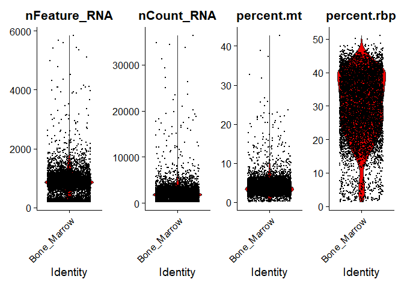
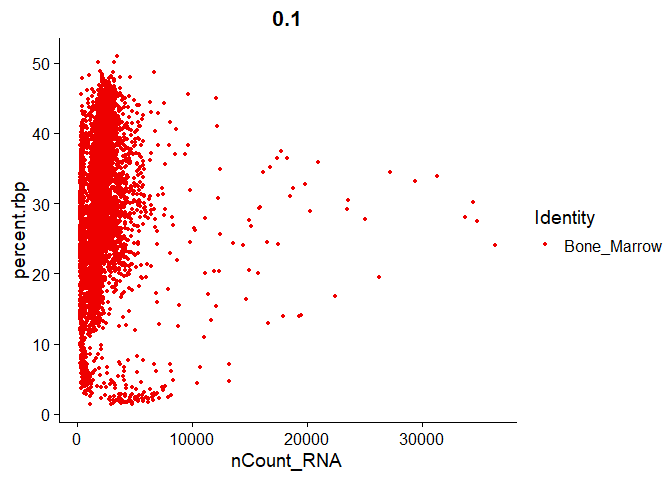
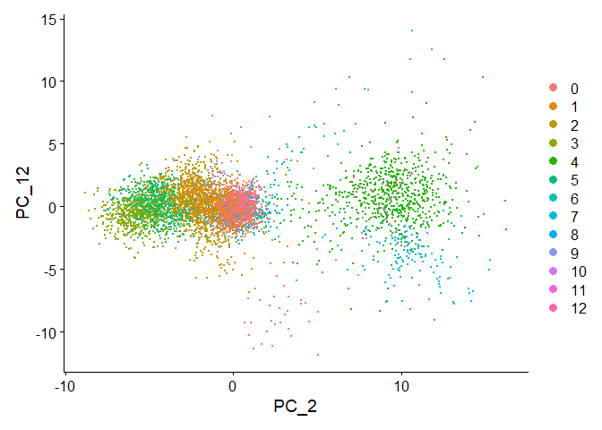

Single cell analysis
================
Giulio Scarpa and Giovanni Marteletto
16/6/2022

## Quality Control and Setup

First of all we need to load the libraries needed

``` r
rm(list = ls())

library(dplyr)
library(Seurat)
library(patchwork)
library(stringr)
library(ggplot2)
```

We load the previously downloaded dataset from PanglaoDB. Before
creating the object we will work on, we need to change the
identification of the genes in a more interpretable notation, such as
gene symbols. So we need to split the rownames and take only the gene
symbol id.

``` r
load('./SRA779509_SRS3805265.sparse.RData')

# cutting all the part after the gene symbol
rownames(sm) <- lapply(rownames(sm), FUN = function(x){
  if (str_count(x, '_') != 1){
    a <- strsplit(x, '_')
  x <- paste(a[[1]][1], a[[1]][2], sep='_')
  }
  else{
    x <- strsplit(x, '_')[[1]][1]
  }
})
```

We can proceed with the creation of the Seurat object. As a first
filtering step we eliminate cells in which there are less than 200 genes
expressed and also all the genes that are expressed in less than 3 cells

``` r
pbmc <- CreateSeuratObject(sm,  project = "Bone_Marrow",  min.cells = 3,  min.features = 200)
head(rownames(pbmc), n=30)
```

    ##  [1] "7SK.1"    "A1BG"     "A1BG-AS1" "A2M"      "A2M-AS1"  "A2ML1"   
    ##  [7] "A2MP1"    "A4GALT"   "AAAS"     "AACS"     "AADAT"    "AAED1"   
    ## [13] "AAGAB"    "AAK1"     "AAMDC"    "AAMP"     "AAR2"     "AARD"    
    ## [19] "AARS"     "AARS2"    "AASDH"    "AASDHPPT" "AASS"     "AATBC"   
    ## [25] "AATF"     "AATK"     "ABALON"   "ABAT"     "ABCA1"    "ABCA10"

## Quality Control

In this stage we check for different parameters that allows us to infer
the quality and reliability of the data coming from the cells. In
particular we look at the number of features, the % of ribosomal protein
genes and mitochondrial genes.

These genes are identified by their prefixes

``` r
# calculate mitochondrial percentage in scRNA-Seq count tables, i.e. all genes starting with MT-
pbmc[["percent.mt"]] <- PercentageFeatureSet(pbmc, pattern = "^MT-")

# same for ribosomal proteins
pbmc[["percent.rbp"]] <- PercentageFeatureSet(pbmc, pattern = "^RP[LS]")

# showing the number of RNA transcript per cell
head(pbmc@meta.data, 5)
```

    ##                   orig.ident nCount_RNA nFeature_RNA percent.mt percent.rbp
    ## AAACCTGAGCAACGGT Bone_Marrow        524          379   2.671756    18.32061
    ## AAACCTGAGCCCAGCT Bone_Marrow        513          322   3.118908    23.58674
    ## AAACCTGAGCGATTCT Bone_Marrow       1612          850   3.349876    15.50868
    ## AAACCTGAGTACGTAA Bone_Marrow       1632          796   5.392157    21.75245
    ## AAACCTGAGTGTACCT Bone_Marrow       1902          833   2.471083    39.16930

At this point we can use plots to visualize the quality parameters

``` r
#plotting data and computed percentages as violin plot
#now we are able to check the quality of the parameters an decide which cells to keep
VlnPlot(pbmc, features = c("nFeature_RNA", "nCount_RNA",  "percent.mt",  "percent.rbp"), 
        ncol =4, cols=c("red2"))
```

<!-- -->

By looking at the violin plots we decided that 9% was a good cut-off for
the mitochondrial genes.

We can also look at the relationship between these parameters to see if
they are related.

``` r
FeatureScatter(pbmc, feature1 =  "nCount_RNA", feature2 =  "percent.mt", cols = 'red2') # on the top of the graph you can see the correlation coefficient, but just looking at the plot we can clearly see that there's no correlation
```

<!-- -->

``` r
FeatureScatter(pbmc, feature1 = "nCount_RNA", feature2 =  "nFeature_RNA", cols = 'red2')# here we can see that in fact there's correlation between the number of expressive genes and the number of reeds in our sample
```

<!-- -->

``` r
FeatureScatter(pbmc, feature1 = "nCount_RNA", feature2 = "percent.rbp", cols = 'red2')# no correlation
```

<!-- -->

After looking at the violin plot of gene expression, we decided to use
as limit the following cutoff: \* less than 9% mitochondrial genes \*
more than 250 features \* less than 2000 features

``` r
pbmc <- subset(pbmc, subset = nFeature_RNA > 250 & nFeature_RNA < 2000 & percent.mt < 9)
```

Inspecting the Seurat object we can make the comparison between before
and after the cell filter 22713 genes across 6937 cells before filtering
22713 genes across 6086 cells after filtering

For 10x data the normalization is done just by multiplying the number of
counts of a gene for 10000 to make it more readable and then compute the
logarithm of the normalized counts. After scaling we compute the
log2-counts per million of each gene across the cells. We inspect the
counts and normalized counts

``` r
pbmc <- NormalizeData(pbmc, normalization.method = "LogNormalize", scale.factor = 10000)

#counts
head(pbmc@assays$RNA@counts)
#normalized counts
head(pbmc@assays$RNA@data)
```

Now we check genes related to the regulation of cell cycle. The goal is
to know if the similarity within cells in my cluster is given only by
non-cycle related genes or if they play a role in the classification of
the cells.

``` r
pbmc <- CellCycleScoring(pbmc, s.features = cc.genes.updated.2019$s.genes, 
                         g2m.features = cc.genes.updated.2019$g2m.genes, set.ident =TRUE)
head(pbmc[[]])
```

    ##                   orig.ident nCount_RNA nFeature_RNA percent.mt percent.rbp
    ## AAACCTGAGCAACGGT Bone_Marrow        524          379   2.671756    18.32061
    ## AAACCTGAGCCCAGCT Bone_Marrow        513          322   3.118908    23.58674
    ## AAACCTGAGCGATTCT Bone_Marrow       1612          850   3.349876    15.50868
    ## AAACCTGAGTACGTAA Bone_Marrow       1632          796   5.392157    21.75245
    ## AAACCTGAGTGTACCT Bone_Marrow       1902          833   2.471083    39.16930
    ## AAACCTGAGTTCGATC Bone_Marrow        906          497   4.194260    28.69757
    ##                       S.Score    G2M.Score Phase   old.ident
    ## AAACCTGAGCAACGGT  0.284813234  0.055523605     S Bone_Marrow
    ## AAACCTGAGCCCAGCT -0.015349896 -0.037877023    G1 Bone_Marrow
    ## AAACCTGAGCGATTCT  0.006722767 -0.078181184     S Bone_Marrow
    ## AAACCTGAGTACGTAA  0.006730119  0.003875733     S Bone_Marrow
    ## AAACCTGAGTGTACCT -0.046212174  0.002266109   G2M Bone_Marrow
    ## AAACCTGAGTTCGATC  0.059931665 -0.000769852     S Bone_Marrow

Each cell is a point in a n-dimensional space, where n is the number of
genes considered. The closer are two points the more similar are the
transcriptomes of the corresponding cells. However, the dimensions are
too many for further processing. Also, most of the coordinates of each
cell would be zero. So, a better strategy is to keep a subset of the
genes, that is, those with the greatest variability of expression across
cells.

The default method ‘vst’ estimates the mean-variance relationship of
each gene, and chooses the 2000 genes with the highest variance. With
this method we can discard most of the 0 expression genes, the
housekeeping genes and all those which presents an overexpression in
just a couple of cells

``` r
pbmc <- FindVariableFeatures(pbmc, selection.method = "vst", nfeatures = 2000)
```

Identifying the 10 most highly variable genes and visualizing them.

``` r
top10 <- head(VariableFeatures(pbmc), 10)

plot1 <- VariableFeaturePlot(pbmc)
LabelPoints(plot = plot1, points = top10, repel = TRUE)
```

<!-- -->

The next step is to scale the counts to shift the expression of each
gene, so that the mean expression across cells is 0 and the variance
across cells is 1.

``` r
all.genes <- rownames(pbmc)
pbmc <- ScaleData(pbmc, features = all.genes) # Centering and scaling data matrix
```

In this step we can remove unwanted effects so it’s a good idea to check
for example if the Cell Cycle genes are interfering with the clustering.

We run a PCA to first check if there is an association between the cells
given only by the cell cylce phase and we can plot the results

``` r
pbmc <- RunPCA(pbmc, features = VariableFeatures(object = pbmc))

print(pbmc[["pca"]], dims = 1 : 5, nfeatures = 5)
```

    ## PC_ 1 
    ## Positive:  IL32, TRAC, AC245427.1, CCL5, CTSW 
    ## Negative:  CSTA, CST3, FCN1, LYZ, S100A9 
    ## PC_ 2 
    ## Positive:  IGHM, MS4A1, BCL11A, CD79A, LINC00926 
    ## Negative:  NKG7, CCL5, GZMA, GNLY, CTSW 
    ## PC_ 3 
    ## Positive:  HBB, HEMGN, GYPA, ALAS2, HBD 
    ## Negative:  CCL5, GZMA, NKG7, ACTB, CTSW 
    ## PC_ 4 
    ## Positive:  NKG7, GZMB, GNLY, KLRD1, KLRF1 
    ## Negative:  IL7R, LTB, TRAC, LEF1, TRAT1 
    ## PC_ 5 
    ## Positive:  MS4A1, LINC00926, CD79A, TNFRSF13C, IGLC2 
    ## Negative:  LILRA4, SERPINF1, CLEC4C, PPP1R14B, PPP1R14BP3

Here we chose to inspect 5 of the most expressed genes among the first
five principal components

-   PC\_ 1

-     IL32: pro inflamatory cytokine higher in mammal not in rodents

-     TRAC: T Cell Receptor Alpha Constant

-     S100A9: calcium- and zinc-binding protein has a role in regulation of inflammatory processes

-   PC\_ 2

-     IGHM: Immunoglobulins (Ig) are the antigen recognition molecules of B cells

-     GNLY:   anti-microbical peptide released by killer lymphocytes

``` r
VizDimLoadings(pbmc, dims = 1 : 2, reduction = "pca")
```

<!-- -->

The following plot allow us to know if they clusters based on cell cycle

``` r
DimPlot(pbmc, reduction = "pca")
```

<!-- --> We
can see that there aren’t any discernible clusters grouping together
cells based on cell cycle phase so we do not need to worry about it too
much downstream, we don’t need to regress out this effect.

At this point we proceed with the Principal Component number selection.
We want a proper balance, if we don’t use enough PCs the risk is to have
a big portion of the variability unexplained by the final clustering, on
the other hand if we use too many PCs the risk is to introduce noise and
cluster cell types as different even when they are not.

We choose to proceed in two ways:

-   The first by visualizing the elbow plot and assessing when the curve
    reaches a plateau.

-   The second by using a mathematical approach that keep all the PC
    until 70-75% of the variance is explained

``` r
#Elbow plot
ElbowPlot(pbmc, ndims= 30)
```

<!-- -->

``` r
pc.touse <- (pbmc$pca@stdev)^2
pc.touse <- pc.touse/sum(pc.touse)
pc.touse <- cumsum(pc.touse)[1:50]
pc.touse <- min(which(pc.touse>= 0.75))
pc.touse
```

    ## [1] 22

Looking at the Elbowplot, we decided for 20 PCs. The mathematical
computation returns a value of 22 PCs. In further analysis we will use
both number of PCs and compare them at the end. For now, let’s keep the
PCs number as 20.

``` r
pbmc <- FindNeighbors(pbmc, dims = 1:20)
```

Here, we decided to choose a resolution value within the range suggested
by the authors (0.4-1.2), even if their dataset is about 3K cells large,
in our case we have 6k cells. We tested and arrived at the conclusion
that if the resolution value is too high it becomes difficult to
represent the clusters in a nice way.

So we decided to use resolution = 0.7 because otherwise we noticed that
there would be too many clusters which most of them we would have to
cluster together later according to gene expression

``` r
pbmc <- FindClusters(pbmc, resolution = 0.7)
```

    ## Modularity Optimizer version 1.3.0 by Ludo Waltman and Nees Jan van Eck
    ## 
    ## Number of nodes: 6086
    ## Number of edges: 239098
    ## 
    ## Running Louvain algorithm...
    ## Maximum modularity in 10 random starts: 0.8652
    ## Number of communities: 13
    ## Elapsed time: 1 seconds

We compute the number of cells per cluster.

``` r
Cells_clusters <- data.frame(matrix(NA, nrow = 13, ncol = 2))
rownames(Cells_clusters) <- 0:12
colnames(Cells_clusters) <- c('Cluster','Cells')

for (n in rownames(Cells_clusters)){
  Cells_clusters[n,2] <- length(Idents(pbmc)[Idents(pbmc) == n])
  Cells_clusters[n,1] <- as.character(n)
}

Cells_clusters
```

    ##    Cluster Cells
    ## 0        0  1553
    ## 1        1   946
    ## 2        2   739
    ## 3        3   722
    ## 4        4   710
    ## 5        5   666
    ## 6        6   204
    ## 7        7   142
    ## 8        8   138
    ## 9        9   119
    ## 10      10    78
    ## 11      11    39
    ## 12      12    30

plotting all clusters in a bidimentional space composed by the first two
PCA

``` r
DimPlot(pbmc, reduction = "pca")
```

<!-- -->

This a demonstration that only using the first two PCs leads to a good
clustering result

``` r
DimPlot(pbmc,reduction= "pca", dims=c(8, 19))
```

<!-- -->

``` r
DimPlot(pbmc,reduction= "pca", dims=c(2, 12))
```

<!-- -->

Now we try other methods of dimentionality reduction. tSNE

``` r
pbmc <- RunTSNE(pbmc, dims= 1:20)
DimPlot(pbmc, reduction = "tsne")
```

<!-- -->

In the end we decided to use UMAP because the clusters are better
represented.

``` r
pbmc <- RunUMAP(pbmc, dims =  1:20)
DimPlot(pbmc, reduction ="umap")
```

<!-- -->

Note: We also did the same analysis but using a different number of PCs
and resolution at the clustering phase as an experiment of comparison
between the PCs chosen looking at the elbowplot and the number found
with the mathematical procedure. We didn’t went on with the alternative
method (the math one) and choosed to proceed with only the results
coming from the graphical method.

## Clusters and Marker genes analysis

Now we can proceede by checking for example the quality parameters and
how are they distributed in each cluster. This is a good way of
informing if the clusters are divided by other parameters than
differential expression of genes.

``` r
VlnPlot(pbmc,features= "nCount_RNA")
```

<!-- -->

``` r
VlnPlot(pbmc,features= "nFeature_RNA")
```

<!-- -->

``` r
VlnPlot(pbmc,features= "percent.mt")
```

<!-- -->

``` r
VlnPlot(pbmc,features= "percent.rbp")
```

<!-- -->

Cell Cycle quality plot

``` r
pbmc@meta.data %>%
  group_by(seurat_clusters,Phase) %>%
  count() %>%
  group_by(seurat_clusters) %>%
  mutate(percent= 100*n/sum(n)) %>%
  ungroup() %>%
  ggplot(aes(x=seurat_clusters,y=percent, fill=Phase)) +
  geom_col() +
  ggtitle("Percentage of cell cycle phases per cluster")
```

<!-- -->

we return only genes (top 5 for eache cluster) “over expressed”, found
in at least 25% of the cells, and with a logFC threshold of at least
0.25.

``` r
pbmc.markers <- FindAllMarkers(pbmc, only.pos = TRUE, min.pct = 0.25, logfc.threshold = 0.25)
pbmc.markers %>%
  group_by(cluster) %>%
  slice_max(n = 5, order_by = avg_log2FC) -> top5 # ordered by logFC

pbmc.markers %>%
  group_by(cluster) %>%
  slice_min(n = 2, order_by = p_val_adj ) # top 2 ordered by FDR
```

    ## # A tibble: 87 x 7
    ## # Groups:   cluster [13]
    ##        p_val avg_log2FC pct.1 pct.2 p_val_adj cluster gene   
    ##        <dbl>      <dbl> <dbl> <dbl>     <dbl> <fct>   <chr>  
    ##  1 0              0.705 0.999 0.996 0         0       RPL34  
    ##  2 0              0.698 0.999 0.986 0         0       RPS27  
    ##  3 0              0.672 0.999 0.99  0         0       RPL21  
    ##  4 4.22e-256      1.69  0.312 0.018 9.59e-252 1       GZMK   
    ##  5 3.31e-195      1.27  0.919 0.478 7.51e-191 1       IL32   
    ##  6 0              5.25  0.976 0.288 0         2       S100A8 
    ##  7 0              4.73  0.974 0.208 0         2       S100A9 
    ##  8 0              3.82  0.847 0.057 0         2       LYZ    
    ##  9 0              3.81  0.789 0.047 0         2       S100A12
    ## 10 0              3.39  0.905 0.119 0         2       FCN1   
    ## # ... with 77 more rows

``` r
pbmc.markers %>%
  group_by(cluster) %>%
  top_n(n = 10, wt = avg_log2FC) -> top10
```

In the end we choose the logFC among the FDR as oredering factor beacuse
it represents better the overexpression of the genes.

It is useful to get some visualization of the genes expressend on the
clusters. The next plots shows the top genes for each clusters. By
looking at them we can see if they are really representative of the cell
type or not.

``` r
# cluster specific gene expression
FeaturePlot(pbmc, features = c('LEF1', 'GZMK', 'S100A8', 'GNLY', 'IGKC', 'DUSP2', 'CA1', 'IGLC2', 'FXYD5', 'LST1', 'HBA1', 'JCHAIN', 'HLA-DRA'))
```

<!-- -->

``` r
DotPlot(pbmc, features = c('LEF1', 'GZMK', 'S100A8', 'GNLY', 'IGKC', 'DUSP2', 'CA1', 'IGLC2', 'FXYD5', 'LST1', 'HBA1', 'JCHAIN', 'HLA-DRA'))
```

<!-- -->

The overall expression heatmap helps us to detect and investigate
further the cluster similarity, exposing the similarity between cluster
2 and 9 and between cluster 4 and 7.

``` r
pbmc.markers %>%
  group_by(cluster) %>%
  top_n(n = 10, wt = avg_log2FC) -> top10
DoHeatmap(pbmc, features = top10$gene) + NoLegend()
```

<!-- -->

there are indeed some clusters sharing very similar overexpressed genes.
We proceed with the inspection of the markers in clusters 9 and 2 to
verify if they are the same cell type.

``` r
# non parametric wilcox test to find all markers of cluster 2 vs. all the others
cluster2.markers <- FindMarkers(pbmc, ident.1 = 2, min.pct = 0.25, test.use = "wilcox")
cluster2.markers <- cluster2.markers[order(-cluster2.markers$avg_log2FC),]
head(cluster2.markers, n = 10)
```

    ##         p_val avg_log2FC pct.1 pct.2 p_val_adj
    ## S100A8      0   5.251051 0.976 0.288         0
    ## S100A9      0   4.731967 0.974 0.208         0
    ## LYZ         0   3.822184 0.847 0.057         0
    ## S100A12     0   3.810916 0.789 0.047         0
    ## FCN1        0   3.394505 0.905 0.119         0
    ## CSTA        0   3.327503 0.844 0.045         0
    ## MNDA        0   3.297614 0.824 0.055         0
    ## CST3        0   3.077653 0.930 0.137         0
    ## VCAN        0   3.069109 0.756 0.033         0
    ## CXCL8       0   3.037374 0.547 0.047         0

``` r
# non parametric wilcox test to find all markers of cluster 9 vs. all the others
cluster9.markers <- FindMarkers(pbmc, ident.1 = 9, min.pct = 0.25, test.use = "wilcox")
cluster9.markers <- cluster9.markers[order(-cluster9.markers$avg_log2FC),]
head(cluster9.markers, n = 10)
```

    ##                  p_val avg_log2FC pct.1 pct.2     p_val_adj
    ## LST1     9.654345e-113   3.674229 0.992 0.282 2.192791e-108
    ## AIF1     1.104957e-112   3.368772 0.983 0.261 2.509690e-108
    ## MS4A7    8.212155e-284   3.142646 0.840 0.048 1.865227e-279
    ## SERPINA1 5.133711e-192   3.023143 0.916 0.099 1.166020e-187
    ## FCGR3A   3.271805e-122   2.879775 0.899 0.158 7.431251e-118
    ## SMIM25   6.323411e-234   2.792400 0.824 0.058 1.436236e-229
    ## COTL1     2.493444e-80   2.641618 0.941 0.345  5.663360e-76
    ## FCER1G    1.237855e-78   2.604532 0.950 0.334  2.811540e-74
    ## SAT1      2.229103e-73   2.534492 0.975 0.428  5.062962e-69
    ## PSAP      6.290132e-75   2.507271 0.933 0.345  1.428678e-70

``` r
# Here we compare gene expression of both the clusters against all the other 
cluster9AND2.markers <- FindMarkers(pbmc, ident.1 = c(9, 2), min.pct = 0.25, test.use =  "wilcox")
cluster9AND2.markers <- cluster9AND2.markers[order(-cluster9AND2.markers$avg_log2FC),]
head(cluster9AND2.markers, n = 10)
```

    ##         p_val avg_log2FC pct.1 pct.2 p_val_adj
    ## S100A8      0   5.070007 0.920 0.282         0
    ## S100A9      0   4.585350 0.928 0.199         0
    ## LYZ         0   3.643879 0.768 0.052         0
    ## S100A12     0   3.615617 0.693 0.046         0
    ## LST1        0   3.524883 0.946 0.189         0
    ## FCN1        0   3.507532 0.896 0.102         0
    ## AIF1        0   3.341756 0.908 0.171         0
    ## CST3        0   3.291487 0.929 0.120         0
    ## CSTA        0   3.251391 0.800 0.034         0
    ## MNDA        0   3.216221 0.779 0.045         0

``` r
# Comparing difference in expression between cluster 9 and 2 to highlight genes overexpressed in cluster 9 
# in respect to cluster 2 did lead to any particular marker
cluster9_2.markers <- FindMarkers(pbmc, ident.1 = 9, ident.2 = 2, min.pct = 0.25, test.use = "wilcox")
cluster9_2.markers <- cluster9_2.markers[order(-cluster9_2.markers$avg_log2FC),]
head(cluster9_2.markers, n = 10)
```

    ##                p_val avg_log2FC pct.1 pct.2     p_val_adj
    ## FCGR3A 7.107046e-106   3.567869 0.899 0.091 1.614223e-101
    ## MS4A7   4.972911e-50   2.229837 0.840 0.240  1.129497e-45
    ## RHOC    1.818806e-49   1.918252 0.555 0.065  4.131054e-45
    ## IFITM3  3.166240e-34   1.727000 0.748 0.238  7.191481e-30
    ## SMIM25  1.362676e-37   1.715672 0.824 0.299  3.095046e-33
    ## IFITM2  4.083933e-30   1.689685 0.849 0.430  9.275838e-26
    ## LYPD2   4.050953e-51   1.682172 0.294 0.000  9.200930e-47
    ## VMO1    6.716353e-42   1.609716 0.261 0.003  1.525485e-37
    ## HES4    1.060644e-47   1.555198 0.328 0.008  2.409040e-43
    ## FAM26F  1.759273e-37   1.536809 0.672 0.147  3.995837e-33

In the end we can conclude that there is no evidence to posit that
cluster 9 express any marker which lead to a different cell type
compared to cluster 2 so we decide to merge them.

We performed the same procedure for the other 2 clusters

``` r
# Same procedure for the other two clusters 
cluster74.markers <- FindMarkers(pbmc, ident.1 = 7, ident.2 = 4, min.pct = 0.25, test.use = "wilcox")
cluster74.markers <- cluster74.markers[order(-cluster74.markers$avg_log2FC),]
head(cluster74.markers, n = 10)
```

    ##                 p_val avg_log2FC pct.1 pct.2    p_val_adj
    ## IGLV2-23 1.133526e-60   1.883752 0.401 0.007 2.574578e-56
    ## APOD     1.875485e-43   1.824646 0.268 0.001 4.259789e-39
    ## ADTRP    1.982592e-54   1.800942 0.423 0.021 4.503062e-50
    ## IGLV2-14 2.996883e-19   1.639894 0.268 0.045 6.806819e-15
    ## WFDC21P  1.762309e-28   1.485451 0.415 0.077 4.002733e-24
    ## PMAIP1   3.228429e-20   1.415698 0.606 0.273 7.332730e-16
    ## IGLC2    2.783775e-53   1.281619 0.908 0.449 6.322787e-49
    ## IGLC3    1.866881e-32   1.250404 0.901 0.492 4.240246e-28
    ## IL4R     6.795945e-27   1.232968 0.479 0.103 1.543563e-22
    ## TCF4     1.243086e-17   1.177624 0.521 0.224 2.823422e-13

``` r
cluster86.markers <- FindMarkers(pbmc, ident.1 = 8, ident.2 = 6, min.pct = 0.25, test.use = "wilcox")
cluster86.markers <- cluster86.markers[order(-cluster86.markers$avg_log2FC),]
head(cluster86.markers, n = 10)
```

    ##                   p_val avg_log2FC pct.1 pct.2    p_val_adj
    ## LTB        9.715971e-18   2.884750 0.638 0.314 2.206789e-13
    ## TRAC       4.008746e-12   2.527274 0.500 0.221 9.105064e-08
    ## IL32       4.380411e-11   2.213362 0.406 0.132 9.949227e-07
    ## LCK        5.860404e-06   2.181902 0.312 0.147 1.331073e-01
    ## PTPRC      1.238411e-06   2.074689 0.355 0.176 2.812803e-02
    ## BTG1       7.786701e-15   2.036810 0.609 0.319 1.768593e-10
    ## CD3D       2.830317e-08   2.034384 0.413 0.191 6.428499e-04
    ## CD52       5.122862e-21   2.024198 0.768 0.495 1.163556e-16
    ## TRBC2      4.325411e-07   1.927449 0.370 0.172 9.824306e-03
    ## AC245427.1 9.110823e-04   1.850824 0.268 0.157 1.000000e+00

Merging them together

``` r
Idents(pbmc)[Idents(pbmc) == 9] <- 2
Idents(pbmc)[Idents(pbmc) == 7] <- 4
```

Finally we have all markers which identify unequivocally all the cell
types of all the 11 clusters

-   0 LEF1, CCR7 -\> Naive CD4+
    T-cell(<https://en.wikipedia.org/wiki/Lymphoid_enhancer-binding_factor_1>,
    <https://www.proteinatlas.org/ENSG00000126353-CCR7>)
-   1 GZMK, IL7R -\> MAIT T-cell
    (<https://www.proteinatlas.org/ENSG00000113088-GZMK>,
    <https://www.proteinatlas.org/ENSG00000168685-IL7R>, )
-   2 S100A8, S100A9, LYZ -\> Classical Monocyte
    (<https://www.proteinatlas.org/ENSG00000143546-S100A8>,
    <https://www.proteinatlas.org/ENSG00000090382-LYZ>)
-   3 GNLY, GZMB -\> NK-cells
    (<https://www.proteinatlas.org/ENSG00000115523-GNLY>,
    <https://www.proteinatlas.org/ENSG00000100453-GZMB>)
-   4 IGKC, IGLC2-\> Plasmablast
    (<https://www.proteinatlas.org/ENSG00000211592-IGKC>,
    <https://www.proteinatlas.org/ENSG00000211677-IGLC2>)
-   5 CCL5, TRGC2 -\> GdT-cells (
    <https://www.proteinatlas.org/ENSG00000271503-CCL5/immune+cell>)
-   6 CA1, HBM, HBD -\> Naive B-cell
    (<https://www.proteinatlas.org/ENSG00000133742-CA1/immune+cell>,
    <https://www.proteinatlas.org/ENSG00000206177-HBM/immune+cell>)
-   8 LTB, TRAC -\> Memory CD4+
    (<https://www.proteinatlas.org/ENSG00000227507-LTB/immune+cell>,
    <https://www.proteinatlas.org/ENSG00000277734-TRAC/immune+cell>)
-   10 HBA2, HBB -\> Exhausted memory B-cell
    (<https://www.proteinatlas.org/ENSG00000188536-HBA2/immune+cell>,
    <https://www.proteinatlas.org/ENSG00000244734-HBB/immune+cell>)
-   11 IRF7, ITM2C, IRF8 -\> Plasmacytoid DC
    (<https://www.proteinatlas.org/ENSG00000185507-IRF7/immune+cell>,
    <https://www.proteinatlas.org/ENSG00000135916-ITM2C/immune+cell>,
    <https://www.proteinatlas.org/ENSG00000140968-IRF8/immune+cell>)
-   12 HLA-DRA, HLA-DPB1, HLA-DRB1-\> Myeloid DC
    (<https://www.proteinatlas.org/ENSG00000204287-HLA-DRA/immune+cell>,
    <https://www.proteinatlas.org/ENSG00000223865-HLA-DPB1/immune+cell>)

``` r
pbmc.markers %>%
  group_by(cluster) %>%
  top_n(n = 10, wt = avg_log2FC) -> top10
DoHeatmap(pbmc, features = top10$gene) + NoLegend()
```

<!-- -->

We can visualize how the cluster specific genes are expressed within the
clusters and their distribution

``` r
#cell type defining markers
VlnPlot(pbmc, features = c('HBA2'))
```

<!-- -->

``` r
VlnPlot(pbmc, features = c('HLA-DPB1'))
```

<!-- -->

``` r
VlnPlot(pbmc, features = c('S100A8'))
```

<!-- -->

``` r
VlnPlot(pbmc, features = c('GNLY'))
```

<!-- -->

Visualize co-expression of two features simultaneously

``` r
FeaturePlot(pbmc, features = c("LEF1", "GZMK"), blend = TRUE)
```

<!-- --> We
can finally define our clusters as specific cell types

``` r
new.cluster.ids <- c('Naive CD4+ T-cell', 'MAIT T-cell','Classical Monocyte', 'NK-cells', 'Plasmablast', 
                     'GdT-cells', 'Naive B-cell', 'Memory CD4+', 'Exhausted memory B-cell', 'Plasmacytoid DC', 'Myeloid DC')

names(new.cluster.ids) <- levels(pbmc)
pbmc <- RenameIdents(pbmc, new.cluster.ids)
DimPlot(pbmc, reduction = "umap", label = TRUE, pt.size = 0.5) + NoLegend()
```

<!-- -->
